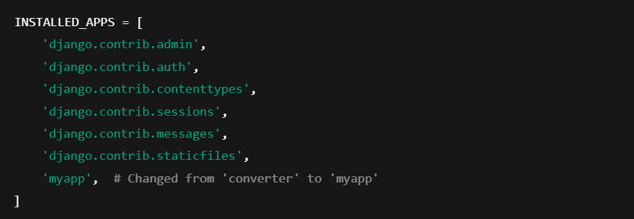

# Django
 # Currency Converter (USD to INR) 💰🇺🇸➡️🇮🇳

A simple Django-based currency converter that converts **US Dollars (USD) to Indian Rupees (INR)** using the latest exchange rate.

---

## **🚀 Features**
✅ Convert **USD to INR** using real-time exchange rates  
✅ User-friendly **UI inspired by Wise (Yellow Theme)**  
✅ Prevents **negative & zero values** in the "Send Amount" field  
✅ **Displays exchange rate dynamically**  
✅ Built with **Django, HTML, CSS, and Bootstrap**

---

## **📂 Project Structure**

Explanation:
- Converter_app/ → Your main Django app, handling currency conversion logic.
- Static/ → Holds CSS, JS, and images for frontend design.
- Templates/ → Contains HTML files for rendering the UI.
- views.py → Handles user requests and returns responses.
- urls.py → Defines URL patterns for navigation.

# **💻 [Execution]**
- Step 1️⃣: Install Django
    -- Run `pip install django`
    -- Run `pip install django requests`
- Step 2️⃣: Create a Django Project
    -- Run `django-admin startproject myproject`
    -- Run  `cd myproject` 
- Step 3️⃣: Create an App (Django projects can have multiple apps)
    -- Run `python manage.py startapp myapp`
    Add myapp to INSTALLED_APPS in settings.py:
    
- Step 4️⃣: Run Migrations
    -- Run `python manage.py migrate` 
- Step 5️⃣: Start Django Server
    -- Run `python manage.py runserver` 

Now, open http://127.0.0.1:8000/ in your browser! 🎉